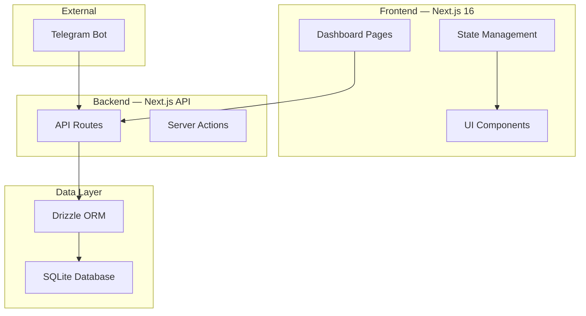

# Life Quant Dashboard

> A behavioral operating system — tracking patterns, consistency, and correlations across life domains. Built as a personal telemetry system, not a gamified habit tracker.

**3,200+ lines of TypeScript** | **7 interactive dashboard pages** | **SQLite + Drizzle ORM** | **Telegram bot integration**

---

## Overview

Life Quant Dashboard is a full-stack application that transforms daily actions into measurable patterns. Instead of streak-based gamification, it focuses on data-driven correlation analysis between domains (e.g., sleep quality vs. deep work output).

The system is designed for **low-friction logging** (≤30 seconds per entry), automated insight generation, and privacy-preserving local-first architecture.

## Architecture

```
┌─────────────────────────────────────────────┐
│  Next.js 16 App Router (Server Components)   │
├─────────────────────────────────────────────┤
│  Server Actions (CRUD, Queries, Analytics)   │
├─────────────────────────────────────────────┤
│  Drizzle ORM → SQLite (Turso-compatible)     │
├─────────────────────────────────────────────┤
│  Domains · Events (Append-Only) · Snapshots  │
└─────────────────────────────────────────────┘
```

### Key Design Decisions

| Decision | Choice | Rationale |
|----------|--------|-----------|
| **Database** | SQLite via Drizzle ORM | Zero infrastructure, local-first, Turso-compatible |
| **State** | Zustand (client) + Server Actions | Minimal client state; server as source of truth |
| **Events** | Append-only log | Immutable audit trail; no destructive updates |
| **Aggregation** | Weekly snapshots (cached) | Avoid O(n) recomputation over raw event log |
| **Input** | Telegram bot + Web UI | Multiple low-friction entry points |

## Tech Stack

| Layer | Technology |
|-------|-----------|
| **Framework** | Next.js 16 (App Router) |
| **Language** | TypeScript 5 |
| **Styling** | Tailwind CSS 4 |
| **Database** | SQLite via Drizzle ORM (Turso-compatible) |
| **State** | Zustand |
| **Charts** | Recharts |
| **AI** | Vercel AI SDK (automated insights) |
| **Bot** | node-telegram-bot-api |
| **Validation** | Zod |

## Database Schema

Three core entities:

1. **domains** — Categories to track (deep-work, sleep, training, mood). Supports typed values (numeric, boolean, scale) with min/max bounds and soft-archive.
2. **events** — Immutable append-only data points. Each record: `timestamp`, `value`, `note`, `source`. Unique constraint on `(domain_id, timestamp)`.
3. **weekly_snapshots** — Pre-computed aggregation cache storing `consistency`, `totalValue`, `numEvents` per domain per week.

## Features

- **Quick-log widget** — ≤30 second data entry
- **Multi-domain heatmaps** — GitHub-style contribution grids per domain
- **Time-series charts** — Trend visualization with period comparisons
- **Correlation analysis** — Cross-domain pattern detection (sleep → deep work output)
- **Burnout gauge** — Early warning indicators from pattern deviation
- **Consistency scoring** — Pattern reliability metrics (not streak counts)
- **Telegram bot** — Log via chat without opening dashboard

## Getting Started

```bash
# Clone
git clone https://github.com/road2qnt/Project-001-Life-Quant-Dashboard
cd Project-001-Life-Quant-Dashboard

# Install
npm install

# Set up environment
cp .env.example .env

# Run migrations
npx drizzle-kit push

# Start development server
npm run dev
```

## Project Structure

```
├── src/
│   ├── app/          # Next.js App Router pages + server actions
│   ├── components/   # UI components (heatmap, charts, quick-log, etc.)
│   ├── cli/          # CLI scripts for terminal data entry
│   ├── lib/db/       # Drizzle schema, migrations, query helpers
│   └── bot/          # Telegram bot integration
├── docs/             # Architecture and design documentation
└── memory/           # AI agent context and decision records
```

## Philosophy

> "The goal is not to log everything. The goal is to understand one thing: what correlates with better outcomes."

This project explicitly rejects streak-based gamification. Instead, it measures:
- **Consistency** — pattern regularity over time
- **Correlation** — how domains influence each other
- **Compounding** — long-term trend detection

---

**Status:** Active development — MVP features operational
**License:** MIT

---

## Screenshots

### Dashboard Overview

<!-- TODO: Add screenshot of the main dashboard showing heatmaps and charts -->
<!-- Example:  -->

To capture: Run `npm run dev`, open `localhost:3000`, and screenshot the main dashboard page showing the heatmap grid.

### Architecture Diagram



## Quick Start

```bash
npm install
npm run dev
# Open http://localhost:3000
```
